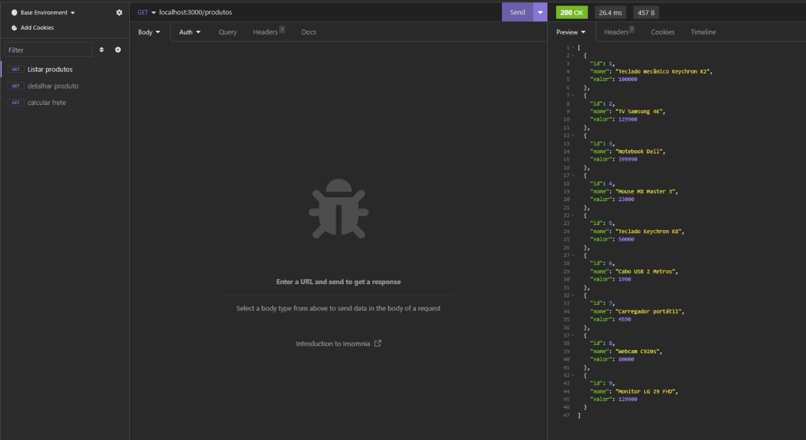
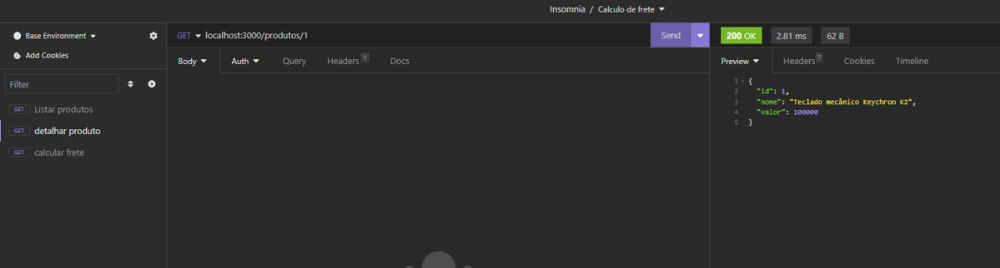
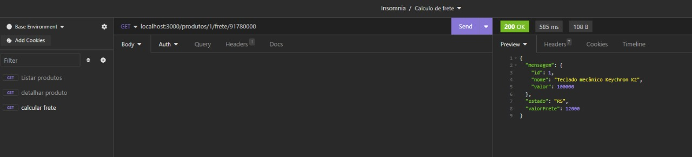

# API de Cálculo de Frete

Este é um projeto de API de cálculo de frete desenvolvido no Visual Studio Code, com testes executados no Insomnia.

## Sobre o Projeto

A API de Cálculo de Frete foi criada para calcular o valor do frete com base no CEP de entrega e no produto escolhido. Ela oferece funcionalidades para listar produtos, detalhar um produto específico e calcular o frete para um produto escolhido.

## Como Executar

Siga os passos abaixo para executar o projeto em sua máquina:

1. Clone este repositório:

```bash
git clone https://github.com/seuusuario/api-calculo-frete.git
```

2. Navegue até o diretório do projeto:
```
cd api-calculo-frete
```

3. Instale as dependências:
```
npm install
```

4. Inicie o servidor:
```
npm start
```
A API estará rodando em http://localhost:3000. <br><br>

## Bibliotecas Utilizadas
*  [express] (https://www.npmjs.com/package/)<br>
* [utils-playground] (https://snyk.io/advisor/npm-package/utils-playground)

## Uso da API

A API possui os seguintes endpoints:

    GET /produtos: Lista todos os produtos disponíveis.

    GET /produtos/:idProduto: Detalha um produto específico com base em seu ID.

    GET /produtos/:idProduto/frete/:cep: Calcula o valor do frete para um produto específico e um CEP de entrega.


## Exemplos de Uso

### Listar Produtos
```
curl http://localhost:3000/produtos
```

### Detalhar Produto
```
curl http://localhost:3000/produtos/1
```
### Calcular Frete
```
http://localhost:3000/produtos/1/frete/91780000
```

## Prints do Projeto
### Listar Produtos
<br>
Exemplo da listagem de produtos na API

### Detalhar Produtos
<br>
Exemplo de detralhes de produto na API
### Calcular Frete
<br>
Exemplo de calculo de fretes na API
## Contribuição
Sinta-se à vontade para contribuir com este projeto. Você pode abrir **issues** ou enviar **pull requests** com melhorias.

## Licença
Este projeto está licenciado sob a Licença MIT.

